# P2-Challenge-2 (Client Side)

> Tuliskan API Docs kamu di sini

# Public (mode tamu)

-  Menampilkan semua data product dalam bentuk `card` secara public tanpa harus login terlebih dahulu
 
- Fitur `SEARCH` untuk mencari data product berdasarkan description
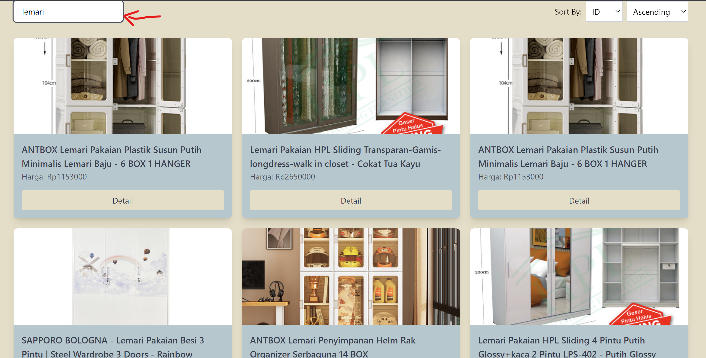
- Fitur `SORT`untuk mencari urutan data product berdasarkan tanggal/id (gatau ide nya dari husen) 
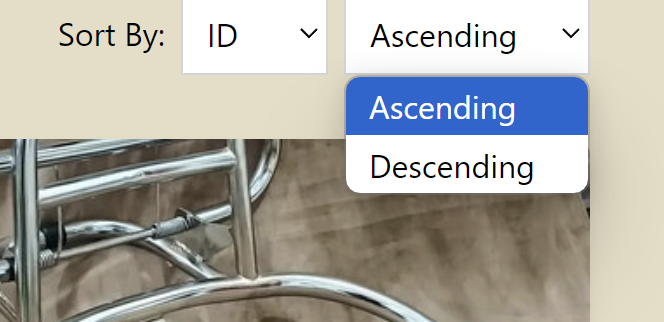
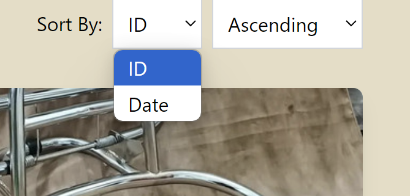
- Fitur `Pagination` untuk urutan 10 card per-halaman  
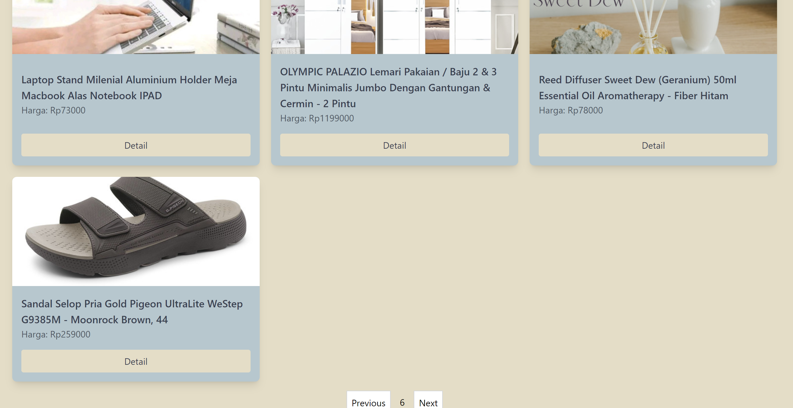
- Tombol `DETAIL` untuk menampilkan detail dari data product berdasarkan id nya 
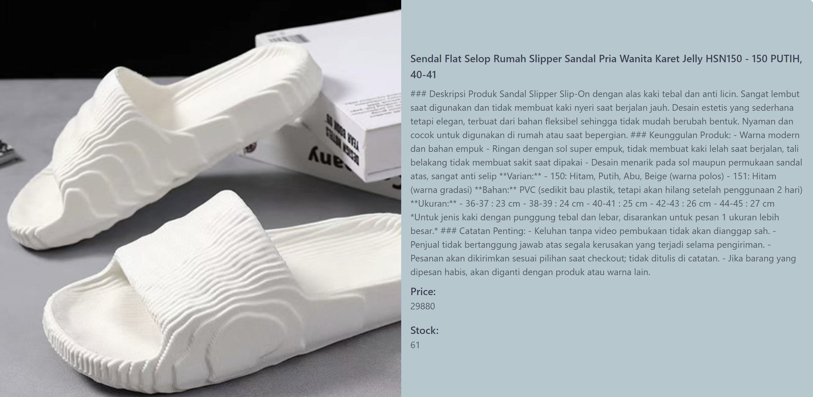

# CMS (mode staff)
- Fitur `SEARCH` untuk mencari data product berdasarkan description
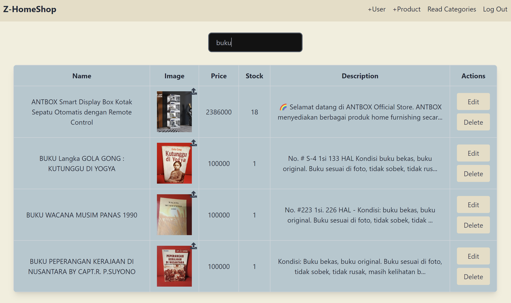

- Fitur  `UPLOAD IMAGE` untuk mengunggah atau mengedit gambar  

- Halaman `Login` 
    - Hanya user yang bisa akses 
    - email : admin@mail.com
    - password : "123456"
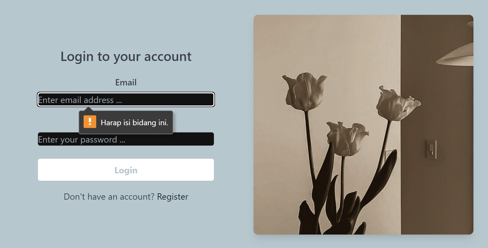

- Komponen `Navbar`
    - Navigasi bar untuk pindah ke halaman lain 
    - "Z-HomeShop" untuk kembali ke halaman Home
    - "+User" untuk berpindah ke halaman form add user
    - "+Product" untuk berpindah ke halaman form add product
    - "Read Categories" untuk berpindah ke halaman categoris
    - "Logout" untuk keluar dari aplikasi
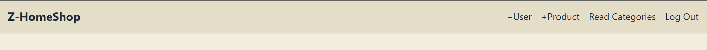

- Halaman `Home` 
    - Menampilkan seluruh data product dalam bentuk `table` dengan tambahan kolom `Actions` agar user bisa mengubah dan menghapus data product.
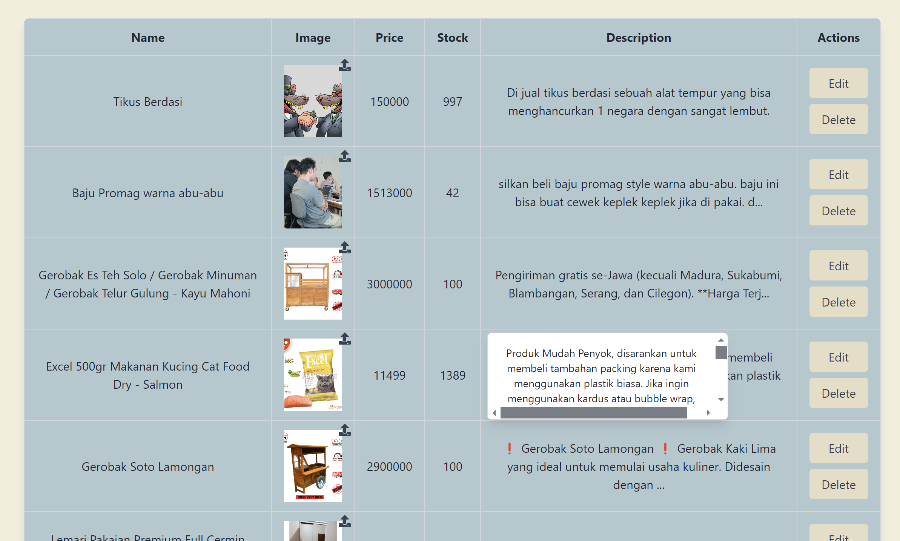

- Halaman `+User`
    - Menampilkan form untuk mengisi data user baru yang ingin di tambahkan 
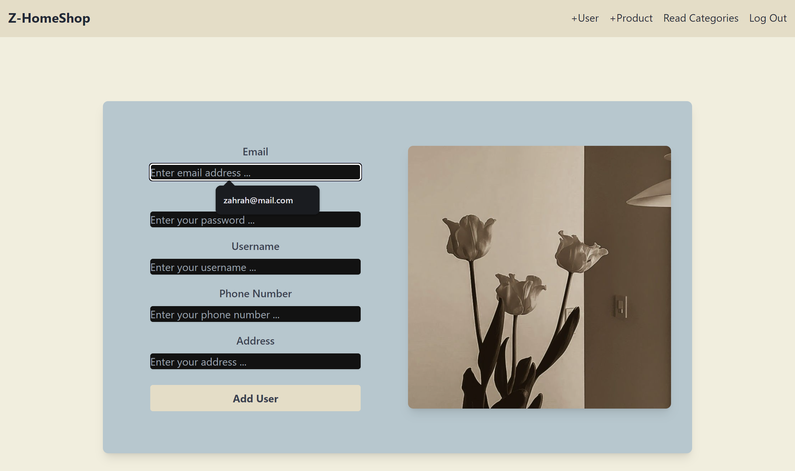

- Halaman `+Product` 
    - Menampilkan form untuk mengisi data baru product baru yang ingin di tambahkan 
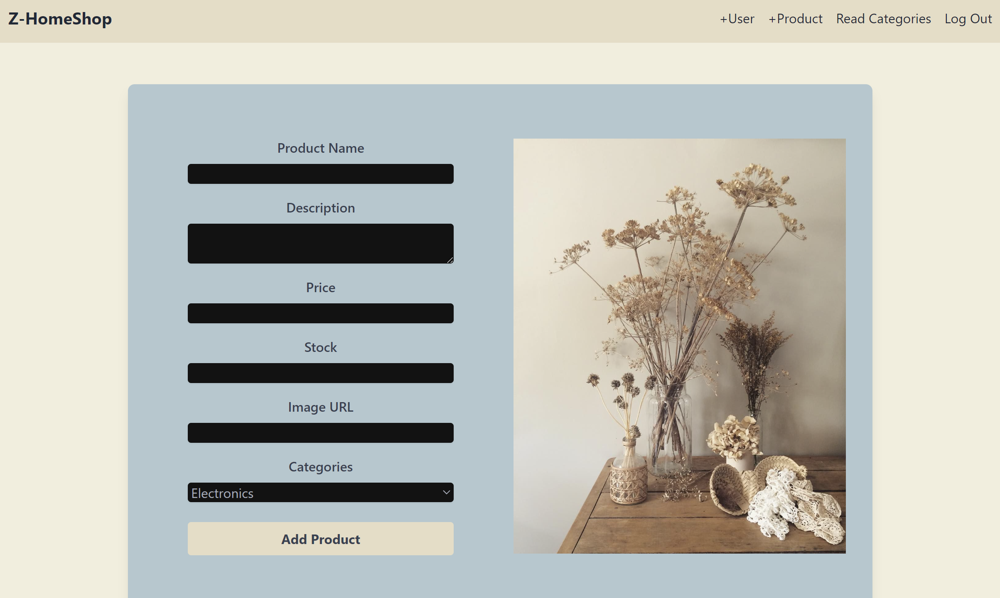

- Halaman `Read Categories` 
    - Menampilkan data Category dari product dalam bentuk `table`
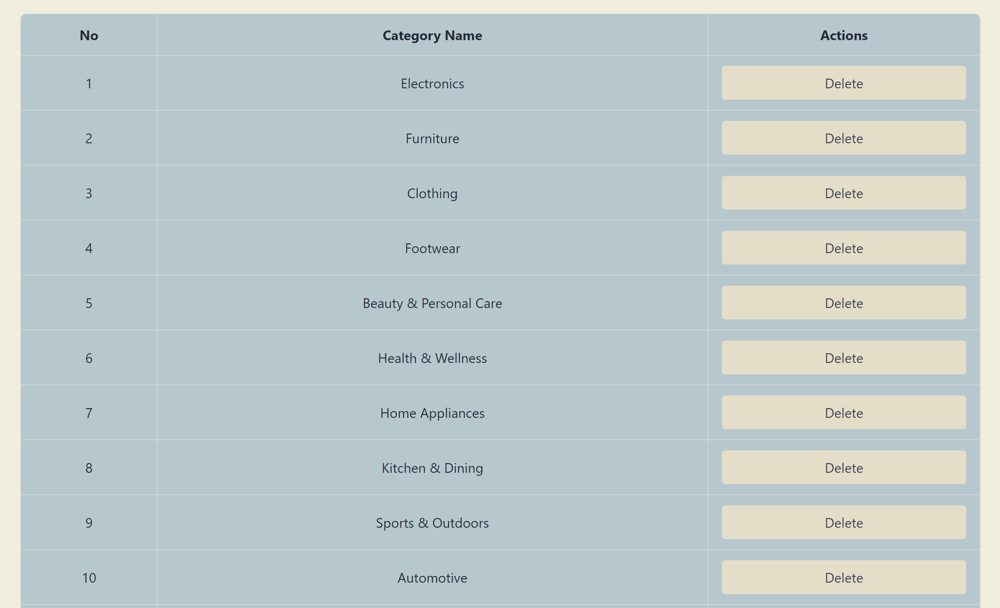
